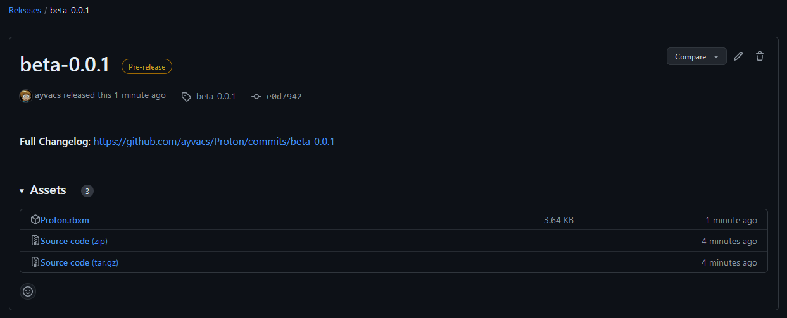

# Installation

Installing Proton is just as easy as using it. You can either **download a precompiled build** (recommended for most users) or **build it yourself** (recommended only for developers)

## Download a precompiled build (recommended for most users)

Head to [the releases page](https://github.com/ayvacs/Proton/releases) where you can see the latest Proton release. 



Simply click the **Proton.rbxm** file and download it to your computer. After, drag it to your Roblox Studio window. A `ModuleScript` named Proton will be inserted to your game; parent it anywhere you'd like, but we suggest `ReplicatedStorage`.

## Build it yourself (recommended only for developers)

!!! info "Installing Rojo"

    To build it yourself, you will need to [install Rojo](https://rojo.space/docs/v7/getting-started/installation/), the tool used by Proton developers to work on the project in VS Code.

After opening a new game and starting the Rojo server on both VS Code and Roblox Studio, simply save the Proton `ModuleScript` in `ReplicatedStorage` to your computer as a `.rbxm` file. You can then use this compiled build in any game.

## After installation

After installation, you can `require` Proton and begin to use it.

```lua linenums="1"
local Proton = require( game:GetService("ReplicatedStorage").Proton ) -- replace this with the path to your Proton installation

local new = Proton.require("new")
```